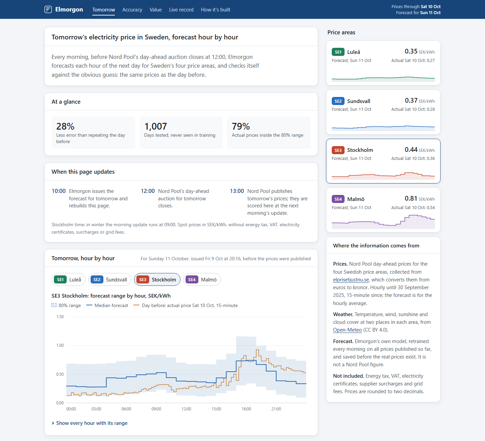
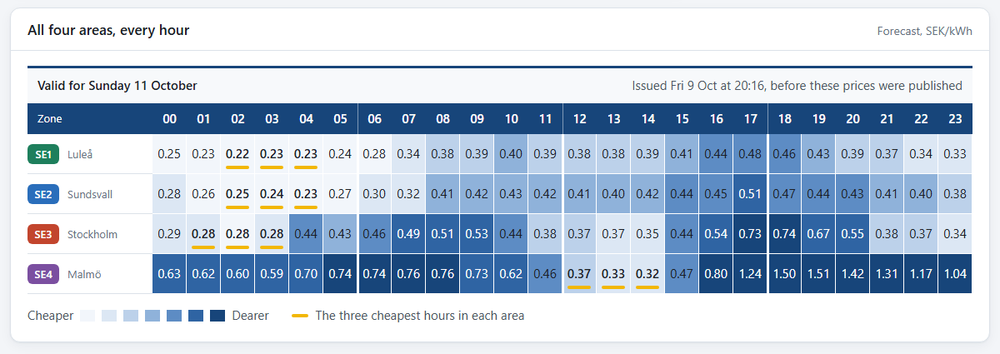
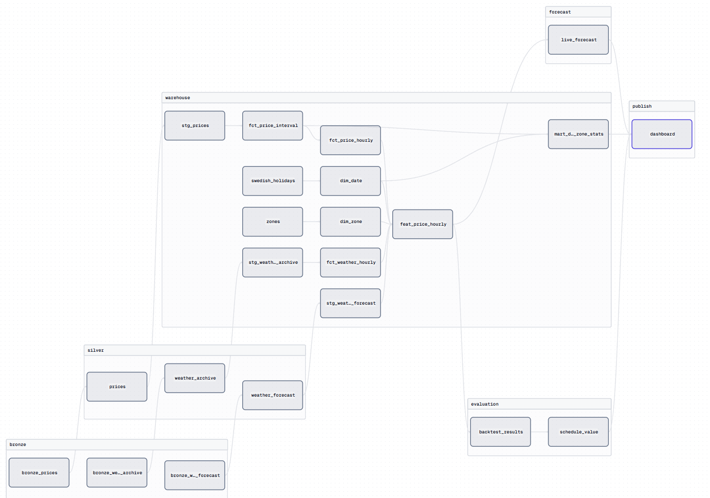

# Elmorgon

[](https://github.com/Shreesha2004/elmorgon/actions/workflows/ci.yml)

Forecasts of tomorrow's electricity prices in Sweden, hour by hour, issued before the auction
closes and tested against simple baselines. The dashboard is live at
**[shreesha2004.github.io/elmorgon](https://shreesha2004.github.io/elmorgon/)** and updates
every morning.

Swedish spot prices swing a lot within a day: on 2 October 2026, SE4 went from 0.25 to 3.19
SEK/kWh. Tomorrow's prices are set in Nord Pool's day-ahead auction, which closes at 12:00, so
anyone who has to act before then (a retailer, or someone scheduling EV charging or a home
battery) has to work from a forecast.

Every morning Elmorgon forecasts each hour of the next day for the four Swedish price zones
(SE1 to SE4). Each forecast is a range (10th, 50th and 90th percentile), calibrated so that the
80% range holds about 80% of outcomes. The forecasts are judged in two ways: by their error
against naive baselines, and in kronor, by using them to schedule an EV and a home battery.



## Results

Walk-forward backtest over 1,007 delivery days (January 2024 to October 2026), all four zones,
every hour. The model is retrained at the start of each month on everything before it and is
only scored on days it hasn't seen.

| Model | MAE (SEK/kWh) | vs. same hour yesterday |
|---|---|---|
| Same hour last week | 0.331 | 38% worse |
| Same hour yesterday | 0.241 | baseline |
| LightGBM, prices and calendar only | 0.199 | 18% better |
| **Elmorgon** (LightGBM + weather) | **0.173** | **28% better** |

It beats the baseline in every zone and every year. The raw quantile models were
overconfident: their 80% range held only 60.2% of actual prices. Conformal calibration on the
previous 90 days of out-of-sample errors brings that to 79.4%.

What the forecast is worth, using spot prices only (no grid fees, tax or VAT):

| | Charge on arrival (18:00) | Plan with today's prices | Plan with Elmorgon | Perfect hindsight |
|---|---|---|---|---|
| EV, 10 kWh/day: average SEK/kWh | 0.65 | 0.38 | **0.31** | 0.25 |
| EV: share of the possible saving | 0% | 68% | **85%** | 100% |
| Home battery: share of the possible profit | n/a | 57% | **67%** | 100% |

For a commuter charging 10 kWh a night, planning with Elmorgon saves about 1,230 SEK a year
compared with plugging in at 18:00.

### The dashboard

The page is a set of panels: what Elmorgon does, the key figures, and when the page updates
(10:00 forecast, 12:00 auction close, 13:00 prices published). Beside them, the four price
areas each have a card with tomorrow's forecast average, the latest actual price and the shape
of tomorrow; clicking a card switches the hourly chart. A panel at the side explains where the
data comes from and what the prices leave out.

Below that, all four areas are laid out hour by hour. Darker cells are more expensive, and the
three cheapest hours in each area are marked.



### Live record

Every live forecast is scored once its prices are published. The record starts on 4 October
2026. Elmorgon lost to "repeat the day before" on both of its first two scored days (4 and 5
October), and the dashboard shows that as it happened. Two days say very little; the record
grows daily.

## How it works

1. **Bronze.** Prices from elprisetjustnu.se (Nord Pool data) and weather from Open-Meteo at 8
   sites are saved exactly as received, one JSON file per zone and day.
2. **Silver.** Each day is validated and written to Parquet. A day that breaks a rule goes to
   `data/quarantine/` with the reason, so a bad payload never reaches the warehouse.
3. **Warehouse.** dbt builds a DuckDB star schema and the feature table, with 22 data tests on
   every build.
4. **Forecast.** LightGBM quantile models predict P10, P50 and P90 for every hour, and conformal
   calibration corrects the interval width.
5. **Value.** Linear programs schedule an EV and a home battery from the forecast, and the plans
   are costed at the prices that actually cleared.
6. **Publish.** Each live forecast is saved once to `forecasts/issued/`, and a static dashboard
   is rebuilt from one JSON file.



Dagster runs the pipeline as 22 assets (every dbt model is its own asset), with a daily job and
a monthly backtest job. The same steps run from the command line, and a scheduled GitHub Actions
workflow runs them every morning and publishes the dashboard to GitHub Pages.

## Running it

```bash
python -m venv .venv
.venv\Scripts\activate             # macOS/Linux: source .venv/bin/activate
pip install -e ".[dev]"

elmorgon ingest      # download prices (November 2022 to today) and weather
elmorgon build       # validate, build the dbt warehouse and run the data tests
elmorgon backtest    # walk-forward backtest and SEK valuation (about 7 minutes)
elmorgon forecast    # issue the forecast for the next unpublished day
elmorgon site        # export site/data/dashboard.json
elmorgon serve       # open the dashboard on http://127.0.0.1:8800
```

`elmorgon daily` runs ingest, build, forecast and site in one go. For the Dagster UI, run
`dagster dev` in the project root.

```bash
pytest               # 80 tests, including the dbt point-in-time test
ruff check .         # lint
```

## Project layout

```
elmorgon/            the pipeline
  bronze.py          API clients and raw, incremental ingestion
  silver.py          validation, quarantine, typed Parquet
  warehouse.py       dbt runner and DuckDB reads
  models.py          baselines and the LightGBM quantile model
  backtest.py        walk-forward backtest and error metrics
  calibration.py     conformal calibration of the intervals
  schedule.py        EV and battery optimisation
  valuation.py       SEK value of each forecast
  forecast.py        live, append-only forecasts
  report.py          dashboard data export
  cli.py             the elmorgon command
transform/           dbt project: staging, marts, features and data tests
orchestration/       Dagster definitions
site/                the dashboard
forecasts/issued/    every live forecast, as issued
tests/               pytest suite
```

## Design notes

### The forecast contract

- **Issued:** 10:00 Stockholm time on day D.
- **Target:** every hour of delivery day D+1, for each zone.
- **Output:** the 10th, 50th and 90th percentile of the hourly average price (SEK/kWh).
- **Allowed information:** prices up to the end of D (published on D-1 at 13:00), calendar
  facts and a weather forecast for D+1. Nothing else, and a test enforces this.

Since 1 October 2025 the day-ahead market clears in 15-minute intervals. The warehouse keeps both
resolutions, but the model forecasts the hourly average, because that is one consistent target
across the whole history (November 2022 onwards). The scheduling is still costed on the real
15-minute prices.

### Point-in-time correctness

[`tests/test_point_in_time.py`](tests/test_point_in_time.py) builds the real dbt project on
synthetic data, multiplies one day's prices by ten, rebuilds, and checks that none of that day's
features changed. If any had, a feature would have been looking at the answer.

### Validation rules and a bug in the source

A price day reaches silver only if its intervals are 15 or 60 minutes long and evenly spaced, it
has the right number of intervals for its length (23, 24 or 25 hours around daylight saving),
there are no duplicates, and every price is present and within 100 SEK/kWh either way. Negative
prices are real and allowed.

The first full run quarantined 28 of 5,732 zone-days, all on daylight-saving days, for two
reasons:

- **The source (autumn).** On the day the clocks go back, the API gives the interval before the
  repeated hour the wrong end offset (`02:00+02:00` to `03:00+01:00`), so it looks two hours
  long. The start times are right, so Elmorgon now ignores `time_end` and adds the resolution to
  each start.
- **My own code (spring).** The expected-length check subtracted two Stockholm datetimes, and
  Python ignores the offset change when both share a `tzinfo`, so the 23-hour day looked like 24
  hours. The check now subtracts in UTC.

After both fixes all 5,732 days pass. The dbt test `assert_complete_delivery_days` checks the
same rule again inside the warehouse.

### Models and calibration

| Name | What it predicts |
|---|---|
| `naive_day` | the same hour on day D, the most recent known day |
| `naive_week` | the same hour one week earlier |
| `gbm_no_weather` | LightGBM on prices and calendar only |
| `gbm` | LightGBM with weather, one model for all zones, quantile loss at 0.1, 0.5 and 0.9 |

The raw quantile models were overconfident. Each zone's interval is widened by the 80th
percentile of how far actual prices fell outside it over the previous 90 days of out-of-sample
predictions (conformalized quantile regression, Romano et al. 2019). Each backtest fold is
calibrated only with earlier folds, and live forecasts use the latest 90 days.

### Scheduling

- **EV:** 10 kWh a day (about 50 km), an 11 kW charger, and the car at home 00:00 to 07:00 and
  18:00 to 24:00. Charging is a fractional knapsack, so filling the cheapest hours first is
  optimal, and a test checks this against the linear program.
- **Home battery:** 10 kWh, 5 kW, 90% round trip, 0.03 SEK/kWh wear, starting and ending each day
  half full. Solved as a linear program with SciPy's HiGHS solver.

Plans are made at the forecast's hourly resolution and spread evenly over the real market
intervals when they are costed.

### Known limitation

Training uses Open-Meteo's archive of short-range forecasts, which is more accurate than the
day-ahead forecast available at a real morning issue. That makes the part of the backtest gain
that comes from weather somewhat optimistic. The model without weather (18% better than the
baseline) is a floor, and the live record is the real test.

## Data and license

Day-ahead prices come from Nord Pool via [elprisetjustnu.se](https://www.elprisetjustnu.se/),
and weather from [Open-Meteo](https://open-meteo.com/) (CC BY 4.0). The code is MIT licensed.
